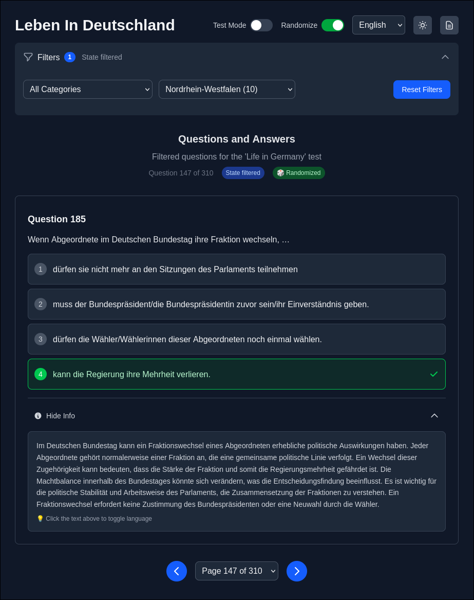

# Leben in Deutschland - Quiz Application

A multilingual quiz application for the German citizenship test ("Leben in Deutschland") built with Next.js and deployed as a static site.



## Features

- 📚 460 questions (300 base + 160 state-specific questions)
- 🌍 Multi-language support (German, English, Turkish)
- 🏛️ State-specific questions for all 16 German states
- 📖 14 question categories
- 🎯 Interactive quiz interface with answer shuffling
- 🧪 Test mode with answer selection and feedback
- 🔀 Question randomization toggle
- ⌨️ Keyboard navigation (Arrow keys, Vim-style j/k keys, Tab navigation)
- 🌓 Dark/light theme support
- 📱 Mobile-responsive design with touch/swipe support
- 🔄 Question navigation and pagination
- ⚡ Skeleton loading states for smooth UX
- 🎛️ Collapsible filter controls
- ⚙️ Settings modal with keyboard shortcuts reference
- 📊 Question cache optimization for performance

## Keyboard Shortcuts

The application supports comprehensive keyboard navigation:

### Navigation
- **Next question:** `→` (Right arrow), `J`, or `Tab`
- **Previous question:** `←` (Left arrow), `K`, or `Shift+Tab`

### Test Mode
- **Select answers:** `1`, `2`, `3`, `4` (number keys)
- **Toggle translations:** `T` (after answering)

### General
- **Close modals:** `Esc`
- **Access shortcuts:** Click the keyboard icon in the top bar

## Getting Started

### Prerequisites

- Node.js 18+ 
- npm

### Installation

1. Clone the repository
2. Install dependencies:
```bash
npm install
```

3. Generate the static data files:
```bash
npm run build:data
```

4. Start the development server:
```bash
npm run dev
```

Open [http://localhost:3000](http://localhost:3000) to view the application.

## Build Commands

### Development
```bash
npm run dev          # Start development server with Turbopack
```

### Production Build
```bash
npm run build        # Generate static data + build for production
npm run build:data   # Generate static data files only
```

### Linting
```bash
npm run lint         # Run ESLint
```

## Project Structure

```
├── data/                    # Source data
│   └── question.json       # Question database
├── src/
│   ├── app/                # Next.js app directory
│   ├── components/         # React components
│   ├── contexts/           # React contexts (theme, language)
│   ├── lib/               # Utilities and hooks
│   └── types/             # TypeScript definitions
├── scripts/
│   └── generate-static-data.js  # Data generation script
└── public/data/           # Generated static JSON files (auto-generated)
```

## Data Generation

The application uses a build-time data generation process that creates optimized JSON files from the source data:

- **Source:** `data/question.json` (460 questions with translations)
- **Output:** `public/data/` (paginated JSON files organized by language, state, and category)
- **Pagination:** 20 questions per page
- **Languages:** German (de), English (en), Turkish (tr)

## Deployment

### Cloudflare Pages

This application is optimized for static deployment on Cloudflare Pages:

**Build Settings:**
- **Build command:** `npm run build`
- **Build output directory:** `out`

The build process:
1. Generates static data files in `public/data/`
2. Creates static HTML/CSS/JS files in the `out/` directory
3. No serverless functions or workers required

### Other Static Hosts

The application can be deployed to any static hosting service (Vercel, Netlify, GitHub Pages, etc.) using the same build output.

## Configuration

### Next.js Configuration
- **Static Export:** Configured for static HTML generation
- **Image Optimization:** Disabled for static deployment
- **Trailing Slash:** Enabled for proper static routing

### Environment
- **Client-side only:** All data fetching happens on the client
- **No API routes:** Uses pre-generated static JSON files
- **Responsive Design:** Mobile-first approach with Tailwind CSS

## Technologies Used

- **Framework:** Next.js 15.4.5 with App Router
- **Language:** TypeScript
- **Styling:** Tailwind CSS v4
- **Deployment:** Static HTML export
- **Data:** JSON with build-time generation

## Contributing

1. Fork the repository
2. Create a feature branch
3. Make your changes
4. Run `npm run lint` to check code style
5. Submit a pull request

## License

This project is for educational purposes related to the German citizenship test.
